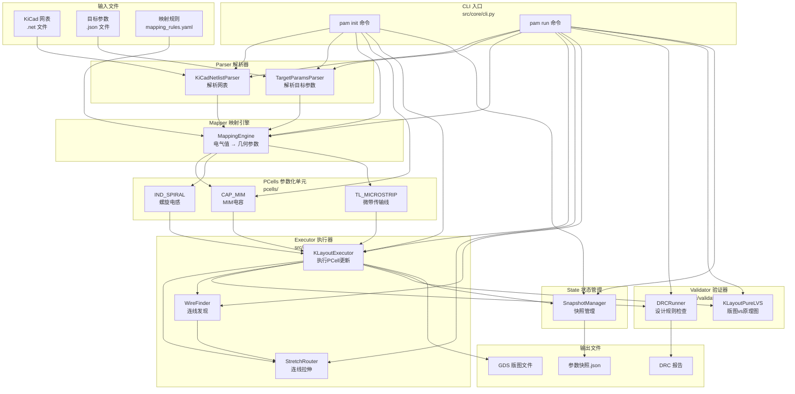

# PAM 项目架构图

## 整体流程图



---

## 模块详解

### 1. CLI 入口 (src/core/cli.py)

**职责：** 命令行入口，解析用户命令

**命令：**
| 命令 | 用途 |
|------|------|
| `pam init` | 冷启动，生成初版 GDS |
| `pam run` | 迭代优化，更新版图 |

---

### 2. Parser 模块 (src/parser/)

#### 2.1 KiCadNetlistParser

**输入：** KiCad 网表文件 (.net)

**输出：**
- `components`: 器件列表 {ref, type, value, footprint}
- `nets`: 网络列表 {name, nodes}

**依赖：** `sexpdata` 库（解析 S-expression）

---

#### 2.2 TargetParamsParser

**输入：** 目标参数文件 (.json)

**输出：** `TargetParam` 列表
```python
TargetParam:
  reference: str   # 器件引用名，如 "C1"
  device_type: str # 器件类型，如 "capacitor_mim"
  params: dict     # 电气参数，如 {"capacitance_pf": 2.0}
```

---

### 3. Mapper 模块 (src/mapper/)

#### MappingEngine

**输入：**
- `TargetParam` 列表
- `mapping_rules.yaml`（查表规则）

**输出：** `MappedGeometry` 列表
```python
MappedGeometry:
  reference: str      # 器件引用
  target_pcell: str   # PCell 类型，如 "CAP_MIM"
  geometry_params: dict # 几何参数，如 {"length": 57, "width": 57}
  warnings: list      # 约束警告
```

**逻辑：**
1. 查表：电气值 → 几何值
2. 字段名映射
3. 约束边界检查

---

### 4. PCells 模块 (pcells/)

| PCell | 输入参数 | 输出 |
|-------|---------|------|
| CAP_MIM | length, width | MIM 电容版图 |
| IND_SPIRAL | inner_radius, turns, width, spacing, angle | 螺旋电感版图 |
| TL_MICROSTRIP | width, length, angle | 传输线版图 |

**每个 PCell 提供：**
- `generate()`: 生成版图形状
- `validate_params()`: 参数校验
- `get_pin_positions()`: 获取引脚坐标
- `get_bounding_box()`: 获取包围盒

**依赖：** `klayout.db`（KLayout Python API）

---

### 5. Executor 模块 (src/executor/)

#### KLayoutExecutor

**输入：**
- GDS 文件路径
- `MappedGeometry` 列表

**输出：**
- 更新的 GDS 文件
- `ExecutionResult`: {success, updated_cells, errors}

**逻辑：**
1. 打开 GDS 文件
2. 定位目标 Cell
3. 调用 PCell 更新参数
4. 调用 StretchRouter 维护连线
5. 保存 GDS

**依赖：** `klayout.db`

---

### 6. Routing 模块 (src/routing/)

#### WireFinder

**输入：**
- GDS 版图数据
- 连接关系（从网表获取）

**输出：** `Connection` 列表
```python
Connection:
  pin1: PinState
  pin2: PinState
  wire: WireGeometry
```

---

#### StretchRouter

**输入：**
- 旧引脚位置
- 新引脚位置
- 原有连线

**输出：** 拉伸后的连线

**逻辑：**
1. 计算引脚位移
2. 擦除旧连线
3. 绘制新连线（L型或直线）

---

### 7. Validator 模块 (src/validator/)

#### DRCRunner

**输入：** GDS 文件

**输出：** DRC 报告（违例数量、错误、警告）

**规则文件：** `config/drc_rules/simple_rf.yaml`

---

#### KLayoutPureLVS

**输入：**
- GDS 版图
- 网表

**输出：** LVS 结果 {match: bool, errors: list}

**逻辑：**
1. 提取版图连通性
2. 与网表对比
3. 报告不匹配

---

### 8. State 模块 (state/)

#### SnapshotManager

**输入：** 运行参数快照

**输出：** `ParamsSnapshot` 文件

```json
{
  "gds_path": "output.gds",
  "timestamp": "2026-05-14T10:30:00",
  "devices": {
    "C1": {
      "ref": "C1",
      "pcell_type": "CAP_MIM",
      "params": {"length": 57, "width": 57},
      "pins": {
        "PI": {"name": "PI", "x": 57.0, "y": 28.5},
        "NIN": {"name": "NIN", "x": 57.0, "y": 4.5}
      }
    }
  }
}
```

---

## 外部依赖

| 依赖 | 版本 | 用途 |
|------|------|------|
| Python | ≥3.10 | 运行环境 |
| klayout | ≥0.28 | GDS 操作、PCell API |
| sexpdata | ≥1.0.0 | 解析 KiCad 网表（S-expression） |
| PyYAML | ≥6.0 | 读取映射规则配置 |

---

## 数据流总结

```
网表(.net) ──┐
              ├──> Parser ──> Mapper ──> PCells ──> Executor ──> GDS
参数(.json) ─┘                 │
                                ├──> Routing(StretchRouter) ──> 连线维护
                                │
映射规则 ────────────────────────┘
                                                 │
                                        ┌────────┴────────┐
                                        ▼                 ▼
                                     Validator          State
                                    (DRC/LVS)      (Snapshot)
                                        │                 │
                                        ▼                 ▼
                                     报告              快照.json
```
