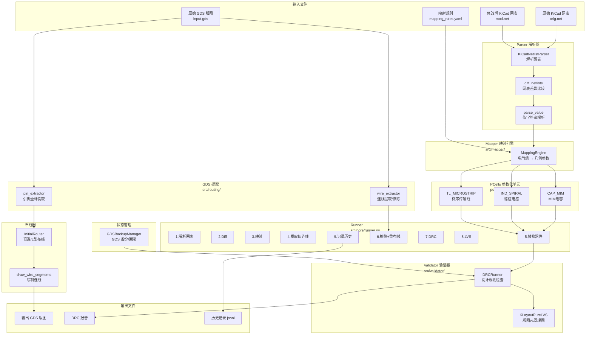

# PAM 项目架构图

## 整体流程图



---

## 核心流程（Runner.run）

```
1. 解析原始网表          KiCadNetlistParser.parse(orig.net)
2. 解析修改后网表        KiCadNetlistParser.parse(mod.net)
3. Diff 网表             diff_netlists() → 找出值变化的器件
4. 映射几何参数          parse_value() + MappingEngine.map()
5. 保存 GDS 备份         GDSBackupManager.save_backup()
6. 更新版图              _update_layout():
   6a. 提取旧连线        extract_wires_from_gds()
   6b. 替换器件          PCell.generate()
   6c. 擦除旧连线        erase_wires_from_top_cell()
   6d. 重新布线          InitialRouter.route_affected_nets()
   6e. 绘制新连线        draw_wire_segments()
7. DRC 验证              KLayoutDRCRunner + 自动重试（最多3次）
8. LVS 验证（可选）      KLayoutPureLVS
9. 记录历史              _append_history()
```

---

## 模块详解

### 1. CLI 入口 (src/core/cli.py)

**职责：** 命令行入口，解析 `pam run` 命令

**命令：**
| 命令 | 用途 |
|------|------|
| `pam run` | 执行版图迭代更新（唯一命令） |

---

### 2. Parser 模块 (src/parser/)

#### 2.1 KiCadNetlistParser

**输入：** KiCad 网表文件 (.net)

**输出：**
- `components`: 器件列表 [{ref, type, value, footprint}]
- `nets`: 网络列表 [{name, nodes}]

#### 2.2 diff_netlists (netlist_diff.py)

**输入：** 两个器件列表

**输出：** `NetlistDiffResult`
```python
NetlistDiffResult:
  changed: List[DeviceDiff]  # 值变化的器件
  errors: List[str]          # 不支持的变更（增减/类型变化）
```

#### 2.3 parse_value (value_parser.py)

**输入：** (part_name, value_str)，如 ("CAP_MIM", "2pF")

**输出：** 电气参数字典，如 `{"capacitance_pf": 2.0}`

---

### 3. Mapper 模块 (src/mapper/)

#### MappingEngine

**输入：** TargetParam + mapping_rules.yaml

**输出：** MappedGeometry
```python
MappedGeometry:
  reference: str       # 器件引用
  target_pcell: str    # PCell 类型，如 "CAP_MIM"
  geometry_params: dict # 几何参数，如 {"length": 57, "width": 57}
  warnings: list       # 约束警告
```

---

### 4. PCells 模块 (pcells/)

| PCell | 输入参数 | 引脚 |
|-------|---------|------|
| CAP_MIM | length, width | PI（正端）, NIN（负端） |
| IND_SPIRAL | inner_radius, turns, width, spacing, angle | P1, P2 |
| TL_MICROSTRIP | width, length, angle | P1, P2 |

**每个 PCell 提供：**
- `generate()`: 生成版图形状
- `validate_params()`: 参数校验
- `get_pin_positions()`: 获取引脚坐标

---

### 5. Routing 模块 (src/routing/)

#### pin_extractor

从 GDS 的子 cell 中提取 PIN marker (255/0) 文本标签，结合 instance 变换计算全局坐标。

```python
extract_pin_positions(layout, top_cell) → {ref: {pin_name: (x_um, y_um)}}
extract_pin_layers(layout, top_cell)    → {ref: {pin_name: (layer, datatype)}}
```

#### wire_extractor

从 top cell 的金属层形状中提取连线，按网络名分组。

```python
extract_wires_from_gds(layout, top_cell, nets) → {net_name: [WireSegment]}
erase_wires_from_top_cell(layout, top_cell, nets_to_erase, wires)
```

#### initial_router

根据引脚位置和网表连接关系生成新连线。

```python
route_connection(pin_a, pin_b)     → [WireSegment]  # 直连或L型
route_affected_nets(...)           → {net_name: [WireSegment]}
draw_wire_segments(cell, layout, wires)
erase_wire_segments(cell, layout, wires)
```

---

### 6. Validator 模块 (src/validator/)

#### DRCRunner

**规则文件：** `config/drc_rules/simple_rf.yaml`

**自动重试：** DRC 失败时缩小参数 0.9x 重试，最多 3 次。

#### KLayoutPureLVS

通过 PIN marker 引脚坐标和金属层连通性验证版图与原理图的一致性。

---

### 7. State 模块 (state/)

#### GDSBackupManager

仅负责 GDS 文件的备份和回滚，不存储任何快照数据。

```python
save_backup(gds_path)     → Optional[Path]  # 保存备份
restore_backup(backup, target) → bool        # 恢复备份
```

---

## 外部依赖

| 依赖 | 版本 | 用途 |
|------|------|------|
| Python | ≥3.10 | 运行环境 |
| klayout | ≥0.28 | GDS 操作、PCell API |
| sexpdata | ≥1.0 | 解析 KiCad 网表（S-expression） |
| PyYAML | ≥6.0 | 读取映射规则配置 |

---

## 数据流总结

```
原始网表 ──┐
            ├──> diff_netlists ──> parse_value ──> MappingEngine ──> PCells
修改后网表─┘                                                       │
                                                                    ▼
GDS ──> pin_extractor ─────────────────────────────────────> _update_layout
GDS ──> wire_extractor ────────────────────────────────────> _update_layout
                                                            │
                                          ┌─────────────────┼─────────────────┐
                                          ▼                 ▼                 ▼
                                     替换器件          擦除+重布线        Validator
                                    (PCell.generate)  (InitialRouter)    (DRC/LVS)
                                          │                 │                 │
                                          └────────┬────────┘                 │
                                                   ▼                          │
                                              输出 GDS ◄──── 回滚(GDSBackup)
                                                   │
                                                   ▼
                                              历史记录
```
